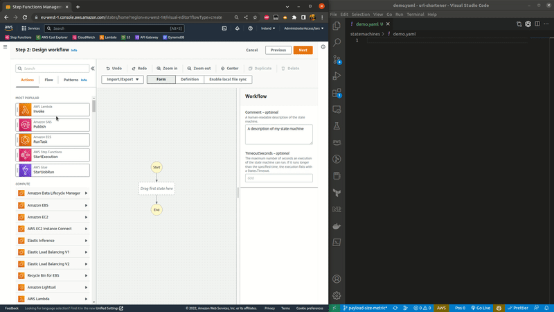

#  StepFunctions Workflow Studio Sync

Third party Chrome extension that enables real time sync between StepFunctions Workflow Studio and your local file system

## Install
* Clone this repo
* run `npm install && npm run build`
* Open chrome://extensions
* Enable the "Developer mode" toggle 
* Click on the "Load unpacked" button
* Select the folder <project_root>/build

## Usage
This extension uses the [File System Access API](https://developer.mozilla.org/en-US/docs/Web/API/File_System_Access_API) to give Chrome temporary access to a single file on your filesystem. Please check your [browser compatability](https://developer.mozilla.org/en-US/docs/Web/API/File_System_Access_API#browser_compatibility)

1. Open [Workflow Studio](https://eu-west-1.console.aws.amazon.com/states/home?region=eu-west-1#/visual-editor?flowType=create)
2. Click the `Enable local sync` button at the top right corner
3. Select the YAML file you want to sync with. 
4. Start building!

## Link SAM template
You can optionally link a SAM template to enable mapping of state machine variables and template resources via [definition substitutions](https://docs.aws.amazon.com/serverless-application-model/latest/developerguide/sam-resource-statemachine.html#sam-statemachine-definitionsubstitutions)

--- 

This project was bootstrapped with [Chrome Extension CLI](https://github.com/dutiyesh/chrome-extension-cli)
